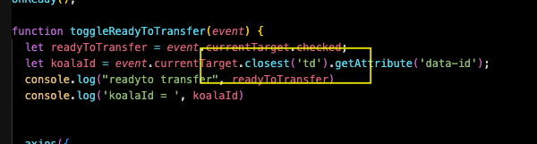
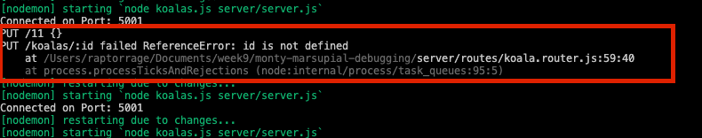
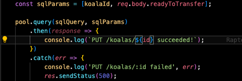

# Bug Report!

## Describe

**What is happening? What do you see?**
When attempting to switch the Ready status of a koala, the toggle is sliding, but it is putting an error in the console log and not staying changed. 

**What _should_ be happening? What do you want to see?**
What I expect to happen is when the toggle is flipped, it will switch the status of that specific Koala to the opposite of what it was already set to. 

## Isolate

**Is this problem client side? Server side? Elsewhere? How do you know?**
From what I deteremined, this error stretched across a few elements on both the Client side and the server side.  
**What line of code is the error happening on?**

Paste the relevant code here:
```js
```
<br>
this image is showing where the client side is attempting to pull the koalaId from.  This is pulling the closest('td') element, when it should be the closest 'tr' element.  The TR is where the koala serialized ID is being stored in the table even though it isn't being displayed.  

Fixing this did not completely resolve the problem. after this, there was an error beign thrown from the koala.router.js side.  <br>
<br>
This is showing that there is an issue with this console log trying to display what info was changed.  id simply needs to be called `koalaId`

And describe what it's doing wrong:
Because of grabbing the ID from the wrong element, it is grabbing null, and trying to pass null as the req.params. 
**What tools did you use to isolate the error?**

- [x] `console.log()`
- [ ] Chrome debugger (_Sources_ panel)
- [ ] VSCode debugger
- [ ] Chrome Network Panel
- [ ] Postman
- [ ] Postico

<!-- Briefly describe how the tool helped you, and how you used it -->


## Fix
I took care of this bug in 2 steps. First was isolating the issue that it was passing `null` into the url, so I knew the `koalaId` was grabbing the wrong info.  I narrowed it down by console logging the event.target, and backing up with the .parentElement until I found what I was looking for.  The actual serialized ID for the Koalas was in the `<tr>` not the `<td>` like the selector was calling to. So switching the `let koalaId = event.currentTarget.closest('tr').getAttribute('data-id');` to TR fixed that issue.  

However, once I fixed that, it was passing the actual ID into the url, but we got a console log error message on the server console log. In the router there was a console log to indicate that the PUT was successful, it was referencing `${id}` when it should read `${koalaId}` which is the actual variable being utilized.

<!--❗ Don't try to fix before first **describing** and **isolating!** 
Briefly describe your fix:-->

**What tools did you use?**

- [x] Fix one line of code. Then test using the debugger or `console.log()`s.
- [ ] Google search
- [ ] Ask a pod mate for help
- [ ] Escalate

**Results**

<!-- Go back to your original description. Is the app behaving how you want it to, now? Describe the bug, technically: what was your code doing wrong, and how did you fix it. -->
After fixing those spots of code, the toggle switch part of the application is functioning corectly as I would expect. The toggle toggles, which triggers the markready for transfer function, which send the info to the server which sends a query to the database to switch the boolean for that koala, and then it triggers the GET function to grab the new data from the database and render it to the DOM. 


